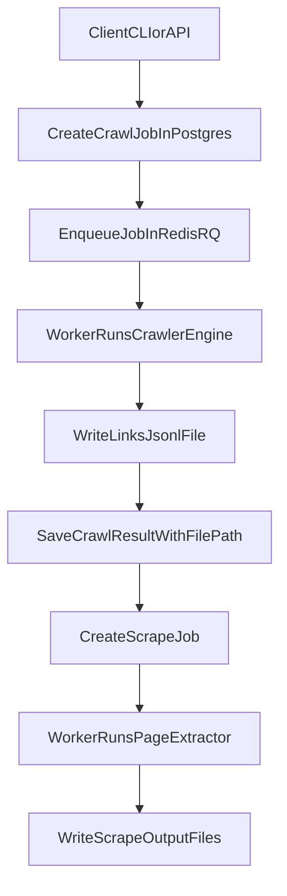

# Web Crawler Monorepo - Full Project Explanation

This document explains the project end-to-end: what it does, why it is organized this way, what each folder/file is responsible for, and how all parts work together.

## 1) What This Project Does

This project is a monorepo for crawling and scraping websites with:

- A **crawl pipeline** that discovers links from a seed URL using BFS-style traversal with limits (`max_depth`, `max_pages`).
- A **scrape pipeline** that reads previously discovered links and extracts page content.
- A **Postgres database** for job metadata and status tracking.
- A **Redis + RQ queue** for async background processing.
- A **FastAPI server** for HTTP access.
- A **Typer CLI** for terminal usage.

The key design choice is splitting work into two job types:

1. **Crawl job**: discover URLs and write all discovered links to `links.jsonl`.
2. **Scrape job**: consume that links file later and produce scraped outputs.

This separation gives better observability and reuse (you can crawl once, scrape many times with different strategies later).

## 2) Why a Monorepo and Workspace

The repository uses a uv workspace so related packages can evolve together while keeping boundaries clear.

- Root workspace config lives in `pyproject.toml`.
- Internal packages are split into:
  - `libs/` (reusable domain/shared/database packages)
  - `apps/` (user-facing executables: API, CLI, worker)

This gives both:
- **Modularity** (clean package boundaries)
- **Operational simplicity** (single repo and lock/sync workflow)

## 3) Top-Level Structure and Why Each Part Exists

## Root files

- `pyproject.toml`
  - Defines workspace members and shared dev tooling.
  - Why needed: one consistent dependency/test setup across all internal packages.

- `.env.example`
  - Canonical environment variable template (`DATABASE_URL`, `REDIS_URL`, data directories, timeout).
  - Why needed: standard onboarding and consistent local/container runtime config.

- `docker-compose.yaml`
  - Starts Postgres, Redis, API container, and worker container.
  - Why needed: reproducible local infrastructure and easy integration testing.

- `Dockerfile`
  - Builds runnable image for API/worker workloads.
  - Why needed: containerized execution and deployment readiness.

- `.dockerignore`
  - Excludes local/non-runtime files from image build context.
  - Why needed: smaller/faster builds and cleaner containers.

## Key file map (quick reference)

- `apps/api/src/api/main.py`
  - API contract and HTTP orchestration layer.
- `apps/cli/src/cli/main.py`
  - Human/operator command interface.
- `apps/worker/src/worker/tasks.py`
  - Async execution of crawl/scrape jobs.
- `libs/crawler-core/src/web_crawler/core/engine.py`
  - Crawl traversal algorithm and limit enforcement.
- `libs/scrapper-core/src/web_scrapper/core/extractor.py`
  - Page content extraction implementation.
- `libs/database/src/crawler_db/services/crawl_service.py`
  - Job lifecycle and business rules.
- `libs/database/src/crawler_db/models/`
  - Relational data model definitions.
- `libs/shared/src/crawler_shared/config.py`
  - Central runtime settings.
- `libs/shared/src/crawler_shared/storage/links_file.py`
  - Bulk link artifact writer/reader.
- `docker-compose.yaml`
  - Local infra + service orchestration.

## Main directories

- `apps/`
  - Runtime entrypoints users/operators interact with.
  - Why needed: keep delivery interfaces separate from domain libraries.

- `libs/`
  - Core reusable logic and data/access layers.
  - Why needed: avoid duplicate logic between API, CLI, and worker.

- `data/`
  - Stores crawl link files and scrape output files.
  - Why needed: keep bulk crawl/scrape output on filesystem, while DB stores references/metadata.

## 4) Apps Layer - What Each App Does

## `apps/api`

Main file: `apps/api/src/api/main.py`

Responsibilities:
- Hosts FastAPI app.
- Exposes endpoints for creating/listing crawl jobs.
- Exposes endpoints for creating/getting scrape jobs.
- Serves links file download via `/crawls/{job_id}/links`.
- Delegates actual logic to services (`CrawlService`, `ScrapeService`) and queue helpers (`enqueue_crawl`, `enqueue_scrape`).

Why this design:
- API stays thin and orchestration-focused.
- Domain logic stays in libs, so CLI and worker use the same behavior.

## `apps/cli`

Main file: `apps/cli/src/cli/main.py`

Commands:
- `crawl`: create crawl job and enqueue.
- `status`: show one crawl job.
- `list`: list recent crawl jobs.
- `links`: print/export links file.
- `scrape`: create scrape job and enqueue.

Why this design:
- Gives operators/developers a direct local interface.
- Reuses the same services as API, minimizing divergence between interfaces.

## `apps/worker`

Main files:
- `apps/worker/src/worker/tasks.py`
- `apps/worker/src/worker/main.py`

Responsibilities:
- Implements async job execution functions:
  - `run_crawl_job(job_id)`
  - `run_scrape_job(job_id)`
- Updates job status transitions (`pending -> running -> completed/failed`).
- Writes filesystem artifacts.
- Persists job results.

Why this design:
- Long-running crawl/scrape logic is decoupled from request/CLI latency.
- Failure handling is isolated and recoverable per job.

## 5) Libraries Layer - What Each Package Owns

## `libs/shared` (`crawler-shared`)

Key files:
- `config.py`: typed settings via `pydantic-settings`.
- `types.py`: shared dataclasses (`DiscoveredLink`, `ScrapedPage`).
- `storage/links_file.py`: write/read JSONL links files.
- `redis/client.py`: Redis connection factory.
- `redis/queue.py`: queue accessor and enqueue helper functions.

Why needed:
- Centralizes cross-cutting concerns used by all apps/libs.
- Prevents duplicated configuration and queue/file logic.

## `libs/database` (`crawler-db`)

Key files:
- `models/crawl_job.py`
- `models/crawl_result.py`
- `models/scrape_job.py`
- `services/crawl_service.py`
- `repositories/crawl_repository.py`
- `repositories/scrape_repository.py`
- `session.py`
- Alembic files in `alembic/`

Responsibilities:
- SQLAlchemy models and persistence mapping.
- Service methods for lifecycle rules and transitions.
- Repository methods for CRUD/query behavior.
- Session/engine management.
- Migration history and schema bootstrapping.

Why needed:
- Keeps persistence/rules in one package.
- Guarantees API, CLI, and worker all operate on the same business rules.

## `libs/crawler-core` (`web-crawler`)

Key files:
- `core/engine.py`
- `core/frontier.py`
- `core/link_extractor.py`
- `utils/url.py`

Responsibilities:
- URL normalization and filtering.
- HTML link extraction.
- BFS traversal with depth/page limits.
- Returning `DiscoveredLink` records and crawl metadata.

Why needed:
- Encapsulates crawling algorithm as pure domain logic.
- Keeps crawling independent from DB/Redis concerns.

## `libs/scrapper-core` (`web-scrapper`)

Key files:
- `core/extractor.py`
- `utils/html.py`

Responsibilities:
- Fetch page HTML.
- Extract title/text payload for scraping outputs.

Why needed:
- Encapsulates scraping logic separate from crawling and scheduling.
- Supports future expansion (alternate extraction strategies).

## 6) Data Model and Why It Looks Like This

The DB has three core tables:

- `crawl_jobs`
  - Job request/lifecycle: seed, limits, status, timestamps, error.

- `crawl_results`
  - Result summary of a completed crawl.
  - Includes `links_file_path` to filesystem artifact.

- `scrape_jobs`
  - Lifecycle and output tracking for scrape operations sourced from a crawl result.

Why file path + metadata instead of per-link table:
- Crawls can generate many links; writing each to DB can be heavy and expensive.
- JSONL file is append/stream friendly.
- DB keeps fast queryable metadata and status while filesystem stores bulk payload.

## 7) End-to-End Flow



### Crawl lifecycle

1. API/CLI creates a `crawl_jobs` row (`pending`).
2. Job ID is enqueued on Redis queue `crawl`.
3. Worker picks job and marks it `running`.
4. `CrawlerEngine` crawls links with:
   - `max_depth` enforcement
   - `max_pages` enforcement
   - optional same-domain restriction
5. Worker writes links into `data/crawls/{job_id}/links.jsonl`.
6. Worker inserts `crawl_results` with `links_file_path` and summary metrics.
7. Job is marked `completed` (or `failed` on exception).

### Scrape lifecycle

1. API/CLI requests scrape for a completed crawl job.
2. `ScrapeService` validates crawl completion and result availability.
3. Job ID is enqueued on Redis queue `scrape`.
4. Worker reads links from `links_file_path`.
5. `PageExtractor` scrapes each URL.
6. Worker writes output files to `data/scrapes/{scrape_job_id}`.
7. Worker updates scrape status and output metadata.

## 8) Technologies Used and Why

- **Python 3.12+**
  - Modern typing/performance baseline.

- **uv workspace**
  - Fast dependency resolution and package workspace management.

- **FastAPI**
  - Strong typing + automatic validation/docs + simple REST implementation.

- **Typer**
  - Clean typed CLI with minimal boilerplate.

- **SQLAlchemy 2.x**
  - Robust ORM and explicit session patterns.

- **Alembic**
  - Schema migration/version control.

- **PostgreSQL**
  - Durable relational store for job lifecycle and metadata.

- **Redis**
  - Fast queue backend and distributed coordination primitive.

- **RQ**
  - Straightforward Redis-backed worker/job processing.

- **httpx**
  - HTTP client for crawl/scrape requests.

- **BeautifulSoup**
  - Practical HTML parsing for links and text/title extraction.

- **pydantic-settings**
  - Typed config from environment variables.

- **Docker / Docker Compose**
  - Reproducible local runtime and dependency orchestration.

## 9) How to Run the Project

From repository root:

```bash
# 1) Install dependencies
uv sync --all-packages --group dev

# 2) Create env file
cp .env.example .env   # macOS/Linux
# or (PowerShell)
Copy-Item .env.example .env

# 3) Start infra
docker compose up -d postgres redis

# 4) Run migrations
uv run --package crawler-db alembic upgrade head

# 5) Start worker
uv run --package worker rq worker crawl scrape

# 6) Start API (separate terminal)
uv run --package api uvicorn api.main:app --reload
```

CLI usage examples:

```bash
uv run --package cli crawler crawl https://example.com --max-depth 2 --max-pages 20
uv run --package cli crawler list
uv run --package cli crawler status <crawl_job_uuid>
uv run --package cli crawler links <crawl_job_uuid> --output ./links.jsonl
uv run --package cli crawler scrape <crawl_job_uuid>
```

API usage outline:

- `POST /crawls`
- `GET /crawls`
- `GET /crawls/{job_id}`
- `GET /crawls/{job_id}/links`
- `POST /scrapes`
- `GET /scrapes/{job_id}`

## 10) Key Design Decisions and Trade-offs

### Decision: split crawl and scrape jobs

Pros:
- better reuse, visibility, and operational control.

Trade-off:
- one extra job and queue step.

### Decision: store discovered links in JSONL files + DB path

Pros:
- scales better for large URL lists and easier artifact portability.

Trade-off:
- additional filesystem management responsibility.

### Decision: RQ over custom queue implementation

Pros:
- simpler, battle-tested worker model.

Trade-off:
- queue semantics limited to RQ feature set.

## 11) Current Limits and Future Enhancements

Current scope:
- no auth on API
- no robots.txt/rate-limiting policy engine
- no Redis-backed persistent crawl frontier
- crawl currently optimized for straightforward HTML link extraction

Future upgrades:
- per-link DB indexing table for analytics/search
- retry/backoff strategy per domain
- richer scrape output schema and content pipelines
- distributed worker scaling and dashboarding

## 12) Glossary

- **crawl_job**: request to discover links from a seed URL.
- **scrape_job**: request to extract page content from links of a completed crawl.
- **links_file_path**: filesystem path stored in DB that points to crawl output (`links.jsonl`).
- **max_depth**: maximum link distance from seed URL.
- **max_pages**: maximum number of pages to fetch in one crawl job.
- **frontier**: queue of candidate URLs to visit next.
- **JSONL**: newline-delimited JSON format, one record per line.
